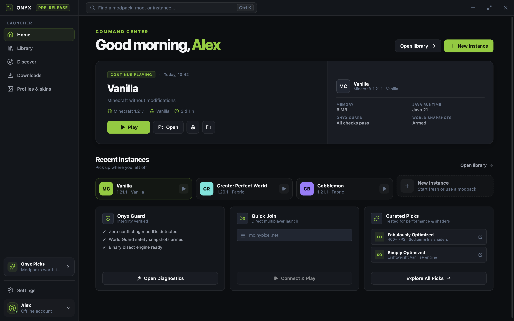
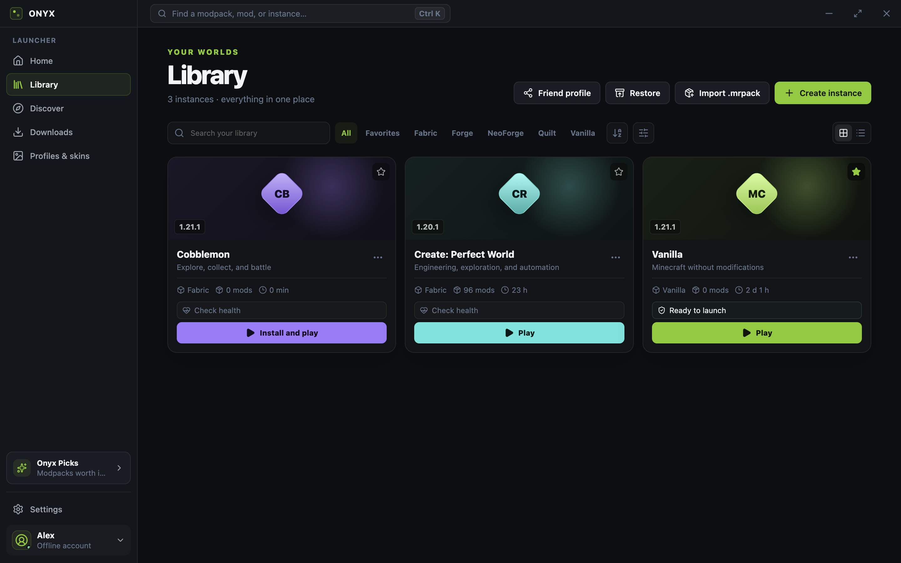
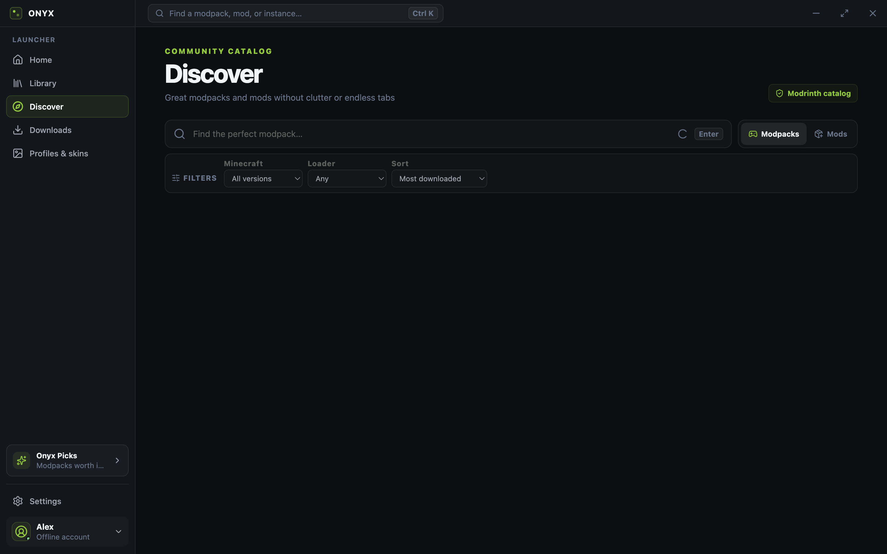
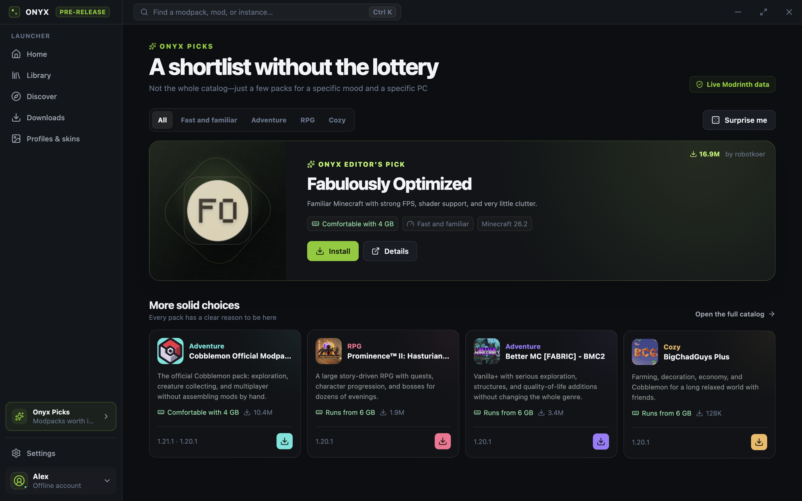
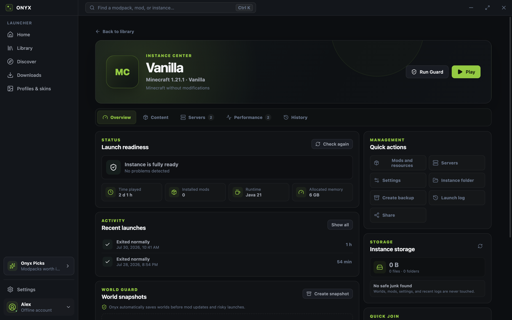
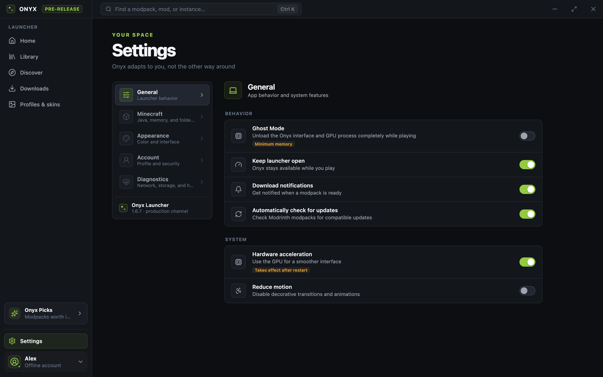
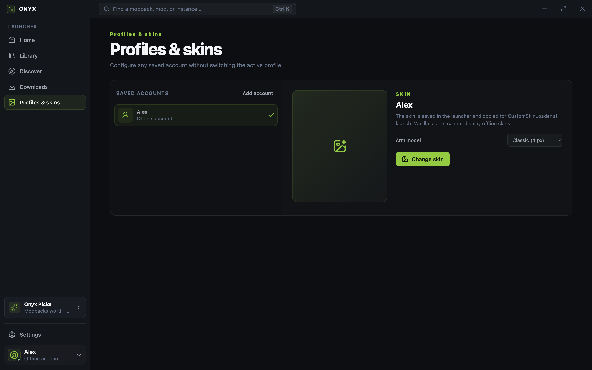

# Onyx Launcher

A modern, English-only Minecraft launcher for Windows and Linux, built with Electron, React, and TypeScript. Onyx keeps game instances isolated, installs official Minecraft files and popular mod loaders, integrates with Modrinth, and launches every instance with its own Java and performance settings.

[Download the latest release](../../releases/latest) · [Good first issues](../../issues?q=is%3Aissue%20is%3Aopen%20label%3A%22good%20first%20issue%22) · [Contribute](CONTRIBUTING.md) · [Share an idea](../../discussions/categories/ideas)

## Screenshots

| Home | Library |
| --- | --- |
|  |  |

| Discover | Onyx Picks |
| --- | --- |
|  |  |

| Instance details | Settings |
| --- | --- |
|  |  |

| Profiles and skins |
| --- |
|  |

All screenshots are generated from the current English UI with `npm run capture:screenshots`.

## Highlights

### Minecraft and Java

- Official Mojang release and snapshot manifests.
- Vanilla, Fabric, Quilt, Forge, and NeoForge support.
- Shared asset and library caches without duplicating files between instances.
- Automatic Eclipse Temurin Java 8, 17, or 21 selection and installation.
- SHA-1, SHA-256, and SHA-512 verification for downloaded files.
- Official Minecraft demo mode without a Microsoft account.
- Per-instance memory, resolution, fullscreen, Java, JVM arguments, and Quick Join settings.
- Onyx AutoTune recommendations based on system memory, Java, and mod count.
- Launch progress, process controls, live logs, and actionable crash diagnostics.

### Instances and data safety

- Dedicated instance pages for health, sessions, content, servers, storage, and actions.
- Multiple saved servers per instance, DNS SRV support, status checks, and Quick Join.
- Ghost Mode releases the launcher window, WebContents, and GPU process while playing.
- Crash Bisect narrows a suspected mod conflict across controlled test launches.
- World Guard creates manual and automatic world snapshots with safe restoration.
- Update Preview shows added, changed, and removed modpack files before installation.
- Onyx Sync exports reproducible settings and exact Modrinth mod versions to `.onyxprofile`.
- Flight Recorder tracks memory, CPU, startup, GC pauses, and per-session performance.
- Optional FPS recording through hidden MangoHud on Linux or PresentMon on Windows.
- Performance baselines compare FPS, 1% lows, memory, and startup time between sessions.
- Safe deletion through the operating-system trash, `.onyxpack` backups, and repair tools.
- Transactional mod profiles, mod update history, storage analysis, and safe cleanup.
- Safe instance-directory migration with verification and rollback.

### Modrinth and accounts

- Searchable Modrinth modpack and mod catalog with filters and pagination.
- Curated Onyx Picks with play-style and memory filters.
- Complete `.mrpack` installation, local import, dependency resolution, and updates.
- Resumable HTTP downloads with cancellation and partial-file cleanup.
- Microsoft/Xbox device-code sign-in without exposing the account password to Onyx.
- Minecraft: Java Edition entitlement checks and multiple saved Microsoft accounts.
- Offline accounts and per-profile skin management.
- Refresh-token encryption through Electron `safeStorage`; tokens remain memory-only when secure storage is unavailable.

## Install

Download an installer or portable archive from the [latest GitHub Release](../../releases/latest):

- Windows x64: NSIS installer or portable `.exe`.
- Linux x64: AppImage or portable `.tar.gz`.
- `SHA256SUMS-windows.txt` and `SHA256SUMS-linux.txt` are attached to every automated release.

Windows builds are unsigned unless a maintainer configures a code-signing certificate, so SmartScreen may display a warning.


### Verify a download

The SHA-256 checksum files attached to each release can be used to verify that a downloaded file matches the published release asset.

#### Windows

Open PowerShell in the directory containing the downloaded `.exe` file and run:

```powershell
Get-FileHash -Algorithm SHA256 .\*.exe
```

Compare the resulting `Hash` value with the matching entry in `SHA256SUMS-windows.txt`.

#### Linux

Open a terminal in the directory containing the downloaded AppImage and run:

```bash
sha256sum --ignore-missing --check SHA256SUMS-linux.txt
```

The command prints `OK` when the downloaded AppImage matches its entry in `SHA256SUMS-linux.txt`.

A matching SHA-256 checksum confirms that the downloaded file matches the published release asset. It does not provide a code signature or prove who created the file.

## Contributing

Small, focused pull requests are welcome. You can start with a curated [good first issue](../../issues?q=is%3Aissue%20is%3Aopen%20label%3A%22good%20first%20issue%22), pick any task marked [help wanted](../../issues?q=is%3Aissue%20is%3Aopen%20label%3A%22help%20wanted%22), or discuss a larger change in [Ideas](../../discussions/categories/ideas).

The [contribution guide](CONTRIBUTING.md) contains the codebase map, local setup, and verification commands. If an issue is unassigned, leave a short comment and start working on it; you do not need to wait for a formal assignment.


## Development

Requirements:

- Node.js 22 or newer.
- Windows 10/11 x64 or a modern x64 Linux distribution.

```bash
npm ci
npm run dev
```

Run the complete local verification suite:

```bash
npm run check
```

Individual commands are also available:

```bash
npm run typecheck
npm run lint
npm test
npm run build:renderer
```

Regenerate every README screenshot from a deterministic local fixture:

```bash
npm run capture:screenshots
```

## Automated releases

The repository uses two GitHub Actions workflows:

- `CI` validates every pull request.
- `Release` batches merged changes into a weekly Friday release and can also be started manually for an urgent release. A scheduled run exits without creating a version when there are no commits since the latest tag.

A successful release workflow:

1. installs locked dependencies with `npm ci` and runs `npm run check`;
2. increments the patch version in `package.json` and `package-lock.json`;
3. commits the version as `chore(release): vX.Y.Z` and creates the matching Git tag;
4. builds Windows and Linux x64 packages on native runners;
5. generates SHA-256 checksum files and publishes a GitHub Release with generated notes.

Set **Settings → Actions → General → Workflow permissions** to **Read and write permissions**. If the release branch is protected, allow `github-actions[bot]` to push the release commit and tag.

## Local packaging

```bash
# Windows NSIS installer and portable executable
npm run dist:windows

# Linux AppImage
npm run dist:linux

# Linux portable tar.gz
npm run dist:linux:archive
```

Build output is written to `release/` and is intentionally excluded from Git.

## Data locations

On Windows:

- launcher state: `%APPDATA%\onyx-launcher\state.json`;
- encrypted accounts: `%APPDATA%\onyx-launcher\account.json`;
- instances: `%APPDATA%\.onyx\instances`;
- shared assets and libraries: `%APPDATA%\.onyx\shared`;
- Java runtimes: `%APPDATA%\.onyx\runtimes`;
- modpack cache: `%APPDATA%\.onyx\packs`;
- update backups: `%APPDATA%\.onyx\backups`.

On Linux, launcher state follows XDG under `~/.config/onyx-launcher`, while game data is stored in `~/.local/share/onyx`. A legacy `~/.config/.onyx` data directory is detected automatically.

## Architecture and security

- `src/` is an isolated React renderer without Node.js access.
- `electron/preload.cjs` exposes a narrow IPC bridge.
- `electron/main.cjs` owns windows, state, filesystem access, and system operations.
- `electron/services/` contains authentication, Minecraft installation, Modrinth, networking, backups, diagnostics, performance, and data-safety services.

The renderer uses `contextIsolation`, Electron sandboxing, and disabled `nodeIntegration`. Navigation, webviews, and browser permissions are restricted. Network and filesystem operations stay in the main process.

Diagnostic exports redact tokens, personal paths, email addresses, and server IPs. Please review [SECURITY.md](SECURITY.md) before reporting a vulnerability.

## Microsoft OAuth

Onyx currently defaults to the public Prism Launcher Microsoft OAuth client ID and its consumer device-code flow. A custom client ID can be supplied for development:

```powershell
$env:ONYX_MICROSOFT_CLIENT_ID="your-client-id"
npm run dev
```

Refresh tokens are tied to the client ID. Accounts must be added again after changing it.

## Contributing

See [CONTRIBUTING.md](CONTRIBUTING.md) for the development and pull-request workflow.

## Legal

Onyx does not distribute Minecraft or bypass its license. Game files are downloaded directly from Mojang, and third-party content is downloaded from URLs provided by Modrinth APIs and manifests. A licensed Microsoft account is required for the full Minecraft: Java Edition experience.

Onyx Launcher is an independent project and is not affiliated with Microsoft, Mojang Studios, or Modrinth. Minecraft is a trademark of Microsoft.

Released under the [MIT License](LICENSE). Third-party attributions are listed in [THIRD_PARTY_NOTICES.md](THIRD_PARTY_NOTICES.md).
