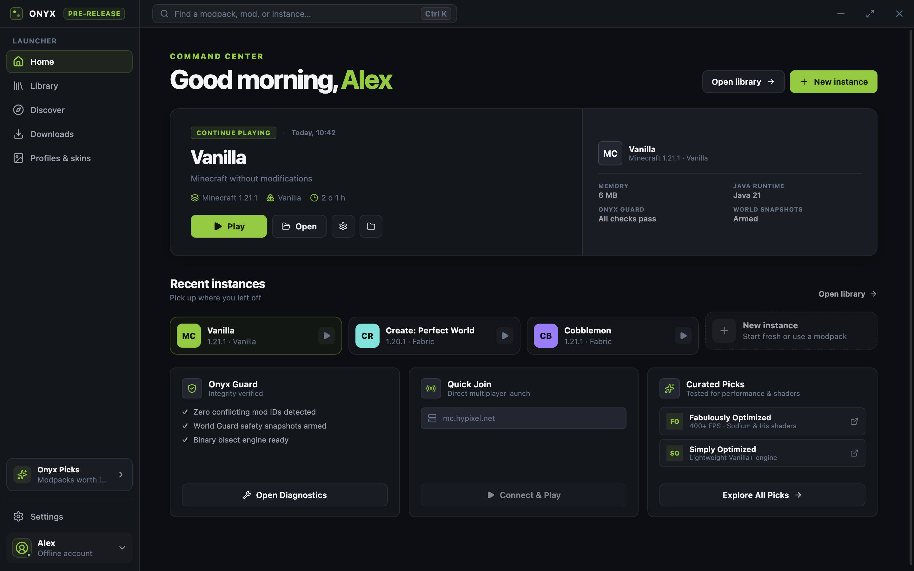
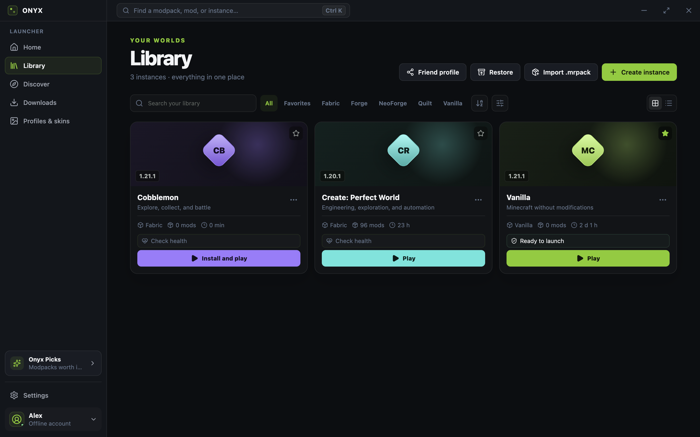
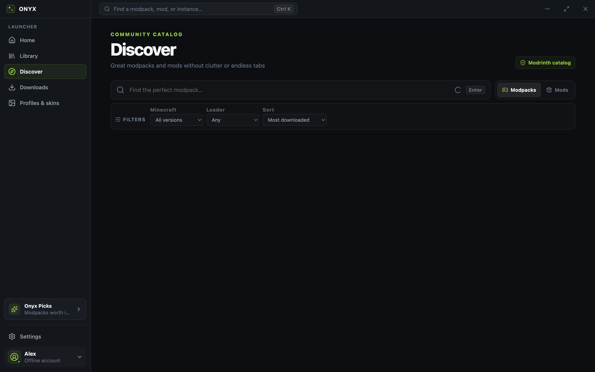
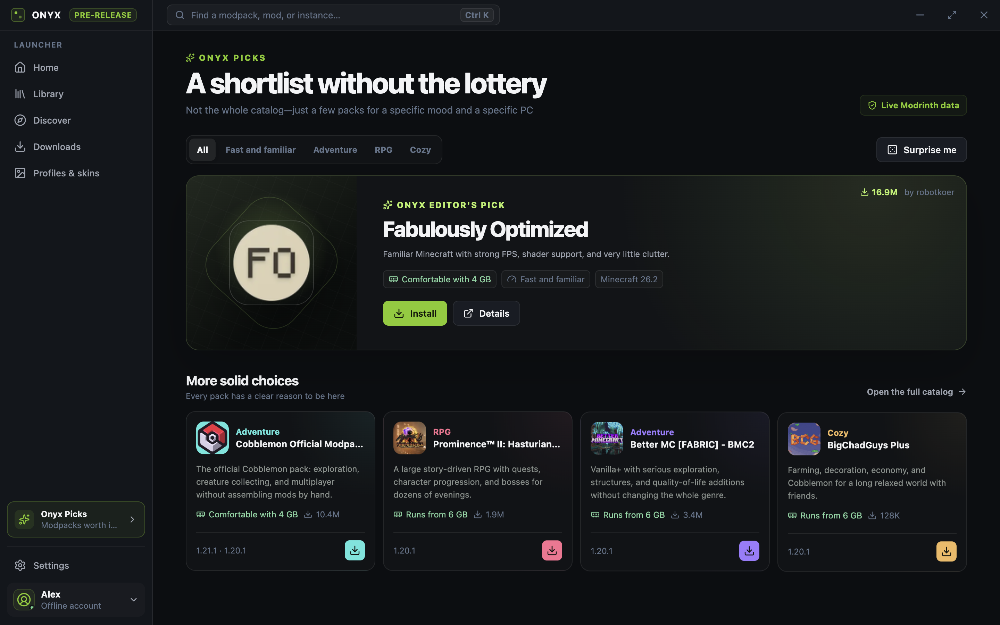
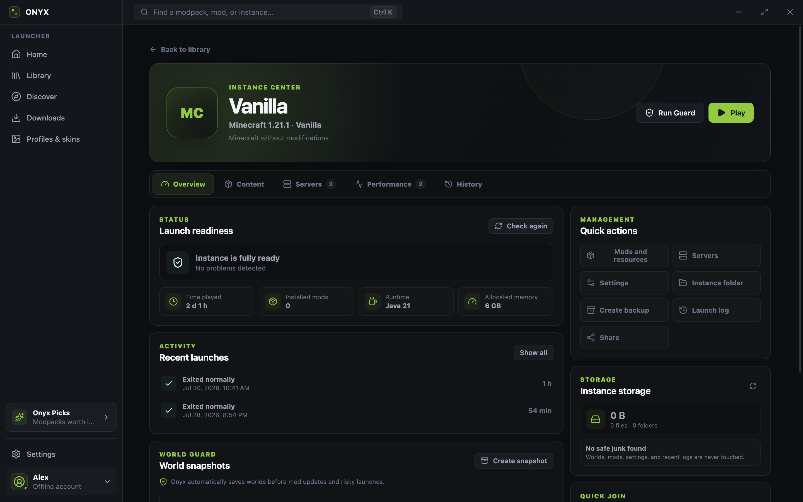
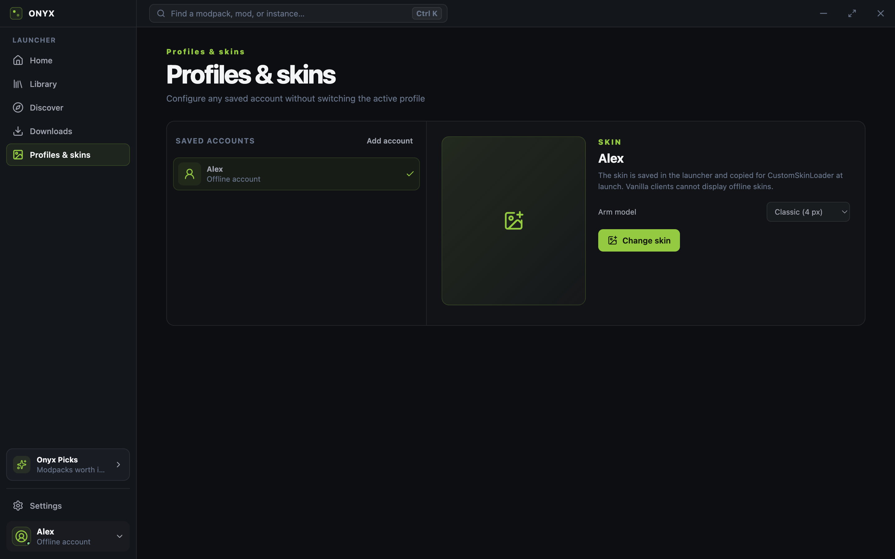
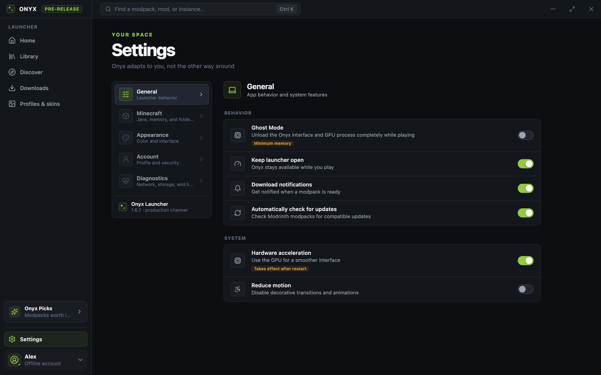

# Scope Launcher

[](https://github.com/lonestill/scope-launcher/actions/workflows/ci.yml)
[](https://github.com/lonestill/scope-launcher/releases/latest)
[](LICENSE)
[](https://github.com/lonestill/scope-launcher/issues?q=is%3Aissue+is%3Aopen+label%3A%22good+first+issue%22)
[](https://github.com/lonestill/scope-launcher/issues?q=is%3Aissue+is%3Aopen+label%3Ahacktoberfest)
[](https://github.com/lonestill/scoop-onyx)
[](https://discord.gg/qHZCehveYp)

A modern, fast, zero-bloat Minecraft launcher for Windows and Linux, built with Electron, React, and TypeScript. Scope is the first Minecraft launcher equipped with a **1-Click Smart Crash Auto-Fixer**, deep mod JAR manifest inspection, automated binary crash bisect diagnostics, 1-click universal migration from all major launchers, and an integrated 3D WebGL skin & cape studio.

[Download the latest release (v1.6.16)](https://github.com/lonestill/scope-launcher/releases/latest) · [💬 Discord Community](https://discord.gg/qHZCehveYp) · [Good first issues](https://github.com/lonestill/scope-launcher/issues?q=is%3Aissue%20is%3Aopen%20label%3A%22good%20first%20issue%22) · [Contribute](CONTRIBUTING.md)

## 💬 Community & Support

Got questions, hit a crash, want to suggest a feature, or test upcoming beta builds? Join our official Discord server:

[](https://discord.gg/qHZCehveYp)

- 🚨 **Instant Crash Troubleshooting**: Paste logs and get help directly from the developers.
- 🧪 **Beta Testing**: Test new engine updates, memory tweaks, and performance tools before release.
- 💡 **Ideas & Feedback**: Share suggestions and discuss what gets built next.

## Screenshots

| Home | Library |
| --- | --- |
|  |  |

| Modrinth Catalog | CurseForge Official Catalog |
| --- | --- |
|  |  |

| Mod Details (Overview & Gallery) | Mod Versions & 1-Click Install |
| --- | --- |
|  |  |

| Curated Scope Picks | Universal 1-Click Migration |
| --- | --- |
|  |  |

| Instance Details & Flight Recorder | 3D Skin & Cape Studio |
| --- | --- |
|  |  |

| Settings & Live Auto-Updater |
| --- |
|  |

All screenshots are generated from the current English UI with `npm run capture:screenshots`.


## ⚡ Feature Comparison

| Feature | Scope Launcher | Prism Launcher | CurseForge App | Modrinth App |
| :--- | :---: | :---: | :---: | :---: |
| **1-Click Smart Crash Auto-Fixer (OOM, Libs, Conflicts, Java)** | **✅ Built-in 1-Click** | ❌ | ❌ | ❌ |
| **Deep JAR Manifest Inspector (Loader & MC Version)** | **✅ Built-in** | ❌ | ❌ | ❌ |
| **Automated Mod Bisect (Find Crash Culprit)** | **✅ Built-in** | ❌ | ❌ | ❌ |
| **Telemetry Flight Recorder & CSV Benchmark Export** | **✅ Built-in** | ❌ | ❌ | ❌ |
| **Native Crash Log Diagnostics** | **✅ Deep Analysis** | ⚠️ Basic | ❌ | ❌ |
| **1-Click Universal Migration (from 8+ launchers)** | **✅ Universal** | ⚠️ Partial | ❌ | ❌ |
| **Built-in 3D WebGL Skin & Cape Studio** | **✅ Three.js** | ❌ | ❌ | ❌ |
| **Dual Modrinth + CurseForge Search & 1-Click Install** | **✅ Both** | ✅ Both | ❌ CurseForge only | ❌ Modrinth only |
| **Discord Rich Presence (RPC)** | **✅ Built-in (IPC)** | 🔌 Third-party | ✅ Built-in | ✅ Built-in |
| **Full Multi-Language Localization (i18n)** | **✅ EN / RU** | ✅ Community | ⚠️ Partial | ⚠️ Partial |
| **Zero Bloat & Telemetry Opt-out** | **✅ Fully Offline-safe** | ✅ Clean | ❌ Ads & Overwolf | ✅ Clean |

## 🛠️ Automated Crash Resolution Matrix (Error & Symptom Lookup)

Scope Launcher is the first desktop Minecraft launcher engineered with an automated repair engine for startup crashes and runtime errors. When Minecraft exits with an error code (such as Exit Code 1), Scope analyzes the game log, inspects mod archives, and displays a verified 1-click resolution with transparent user confirmation:

| Crash Symptom / Error Pattern in Logs | Root Cause Identified | Manual Troubleshooting (Traditional) | Scope Launcher 1-Click Resolution |
| :--- | :--- | :--- | :--- |
| **Exit Code 1 / Exit Code -1 / Exit Code 255** (Generic Startup Failure) | Incompatible mod, wrong loader, or missing dependency | Hours of manual 50/50 binary disabling | **⚡ Deep JAR Inspection + 1-Click Fix or Bisect** |
| `java.lang.OutOfMemoryError: Java heap space` / `GC overhead limit exceeded` | Insufficient allocated RAM for modpack | Edit JVM args manually, risk system freeze | **⚡ 1-Click RAM Calculation (+2GB safe buffer)** |
| `Mod 'xyz' requires {fabric-api}, which is missing!` / `requires {fabric-language-kotlin}` | Missing library / companion dependency | Search Modrinth, match version, download file | **⚡ 1-Click Modrinth Dependency Downloader** |
| `DuplicateModsFoundException: Duplicate mods found` / `Duplicate mod ID` | Duplicate JAR versions in `mods/` directory | Hunt through hundreds of files in Explorer | **⚡ 1-Click Duplicate Mod Disabler (`.disabled`)** |
| `OptiFine is not compatible with Sodium` / `MixinTransformerError: Critical injection failure` | Mutually exclusive rendering mods | Game fails with cryptic mixin injection errors | **⚡ 1-Click Mod Conflict Resolver (Disables culprit)** |
| `com.google.gson.JsonSyntaxException: MalformedJsonException` / `ParsingException` | Damaged or truncated config in `config/` | Manually delete config, lose custom keybinds | **⚡ 1-Click Config Reset (Creates `.bak` & resets)** |
| `UnsupportedClassVersionError: class file version 65.0` (or 61.0) | Java runtime mismatch (Java 21 required for 1.20.5+) | Install separate JDK, point custom path | **⚡ 1-Click Java Auto-Switch to Temurin 21/17** |
| `Unrecognized VM option` / `Could not create Java Virtual Machine` | Invalid or obsolete JVM launch flags | Delete flags line by line | **⚡ 1-Click Reset JVM Flags to Safe Defaults** |
| `java.util.zip.ZipException: zip END header not found` | Corrupted JAR file download | Search corrupted file in logs | **⚡ 1-Click Remove Corrupted JAR & Repair** |
| `Program link failed` / `Composite shader error` / `ShaderCompileError` | Shaderpack compilation error on launch | Dig through Iris config or reinstall modpack | **⚡ 1-Click Shaderpack Disabler (`shaderPack=OFF`)** |
| `GLFW error 65542: The driver does not appear to support OpenGL` | OpenGL driver or multi-GPU context initialization | Reinstall GPU drivers or hunt for mesa DLLs | **⚡ 1-Click OpenGL Workaround (`-Dsun.java2d.opengl=false`)** |
| `GLFW error 65543: GLX: Failed to create context on Wayland` | Linux Wayland compositor / GLX backend mismatch | Set env vars manually in terminal | **⚡ 1-Click Wayland Display Fix (`libglfw.so.3`)** |
| `org.lwjgl.LWJGLException: X Error: BadWindow` / Display initialization failure | Stale display resolution from disconnected monitor | Manually hunt down `options.txt` and reset | **⚡ 1-Click Video Options Reset (Safe 854x480 windowed)** |
| `TextureAtlasException: Stitching texture atlas failed` | Outdated or oversized 512x resource pack OOM | Delete resource packs folder | **⚡ 1-Click Resource Pack Disabler (`resourcePacks:[]`)** |
| `Mod requires fabricloader >=0.16.5, currently 0.15.11` | Outdated modloader version for newer mod requirements | Recreate instance or edit JSON metadata | **⚡ 1-Click Loader Upgrade (Updates loader version)** |
| `UnsatisfiedLinkError: liblwjgl.dylib (have x86_64, need arm64)` | macOS Rosetta x86_64 Java on Apple Silicon | Download native ARM64 JDK manually | **⚡ 1-Click Switch to Native ARM64 Temurin Java** |
| `InaccessibleObjectException: Unable to make class accessible to module` | Java 16+ module encapsulation barrier | Manually add `--add-opens` to launch script | **⚡ 1-Click Java Module Flags Injection (`--add-opens`)** |
| `java.lang.NullPointerException: Ticking entity` | Erroring entity or tile entity ticking loop | Edit world NBT with external MCEdit | **⚡ 1-Click Forge Entity Error Removal (`forge.cfg`)** |
| `Failed to load player data: Corrupt NBT tag` / `UUID.dat` corruption | Damaged playerdata file crashing server/singleplayer | Search world folder, delete inventory | **⚡ 1-Click Playerdata Quarantine (`<uuid>.dat.bak`)** |
| `AccessDeniedException: session.lock is locked by another process` | Lingering background Java zombie process | Open Task Manager, hunt Java PIDs | **⚡ 1-Click Session Lock Cleanup & Process Warning** |
| Forge mod placed into Fabric instance (or vice-versa) | Modloader mismatch | Read crash log or guess mod origin | **⚡ Deep JAR Inspector identifies loader & disables mod** |
| MC 1.16/1.19 mod installed into MC 1.20+ instance | Minecraft version mismatch | Find wrong mod version manually | **⚡ Deep JAR Inspector identifies version mismatch** |
| Unknown multi-mod conflict / elusive launch freeze | Inter-mod interaction or mixin race condition | Spend days manually testing mod subsets | **⚡ Automated Crash Bisect (Binary search test runs)** |

## Highlights

### Smart Crash Auto-Fixer and Diagnostics

- **1-Click Smart Crash Auto-Fixer**: Instantly detects and resolves common crash causes in 1 click:
  - **Missing Dependencies**: Detects missing library mods (`fabric-api`, `fabric-language-kotlin`, `cloth-config`, `architectury`, `yacl`, etc.) and downloads them directly from Modrinth in 1 click.
  - **Duplicate Mod Elimination**: Finds duplicate mod JARs (e.g. `jei.jar` and `jei (1).jar` or conflicting versions) and safely disables the older duplicate file.
  - **Mutually Exclusive Conflicts**: Detects incompatible mod pairs (e.g. OptiFine with Sodium/Iris, or Phosphor with Starlight) and proposes disabling the conflicting mod.
  - **Damaged Configuration Recovery**: Detects JSON/TOML parser crashes in `config/`, creates a `.bak` backup, and resets the config to default values.
  - **Memory Starvation**: Calculates safe RAM boost for `OutOfMemoryError` and GC overhead crashes.
  - **Java & JVM Repair**: Auto-switches to the required Java version on `UnsupportedClassVersionError` (e.g. Java 21 for 1.20.5+) and clears invalid JVM flags.
  - **Corrupted Archive Cleanup**: Removes damaged JAR files failing ZIP headers and initiates integrity check.
- **Deep JAR Manifest Inspector**: Directly inspects `fabric.mod.json`, `quilt.mod.json`, `META-INF/mods.toml`, and `META-INF/neoforge.mods.toml` inside JAR files on crash without extracting files to disk. Instantly catches Forge mods placed in Fabric instances or outdated mod versions (e.g., 1.16/1.19 mods in a 1.20 instance).
- **Automated Mod Bisect**: Runs an automated binary-search diagnostic session across mods to isolate unknown or complex mod conflict culprits in minutes.
- **Strict User Consent**: Every auto-fix action opens a transparent diff modal showing exactly what will be modified (memory limit, disabled mod filename, Java path, or deleted corrupt file) before anything is changed.

### Minecraft and Java

- Official Mojang release and snapshot manifests.
- Vanilla, Fabric, Quilt, Forge, and NeoForge support.
- Shared asset and library caches without duplicating files between instances.
- Automatic Eclipse Temurin Java 8, 17, or 21 selection and installation.
- SHA-1, SHA-256, and SHA-512 verification for downloaded files.
- Official Minecraft demo mode without a Microsoft account.
- Per-instance memory, resolution, fullscreen, Java, JVM arguments, and Quick Join settings.
- Scope AutoTune recommendations based on system memory, Java, and mod count.
- Launch progress, process controls, live logs, and actionable crash diagnostics.

### Instances and data safety

- Dedicated instance pages for health, sessions, content, servers, storage, and actions.
- Multiple saved servers per instance, DNS SRV support, status checks, and Quick Join.
- Ghost Mode releases the launcher window, WebContents, and GPU process while playing.
- Crash Bisect narrows a suspected mod conflict across controlled test launches.
- World Guard creates manual and automatic world snapshots with safe restoration.
- Update Preview shows added, changed, and removed modpack files before installation.
- Scope Sync exports reproducible settings and exact Modrinth mod versions to `.scopeprofile`.
- Flight Recorder tracks memory, CPU, startup, GC pauses, and per-session performance.
- Optional FPS and frame-time recording powered by Scope Probe (JVM agent) or MangoHud on Linux.
- Performance baselines compare FPS, 1% lows, memory, and startup time between sessions.
- Safe deletion through the operating-system trash, `.scopepack` backups, and repair tools.
- Transactional mod profiles, mod update history, storage analysis, and safe cleanup.
- Safe instance-directory migration with verification and rollback.

### Modrinth, CurseForge, and Discovery

- Searchable Modrinth and CurseForge modpack & mod catalogs with official vector branding, filters, and pagination.
- Detailed mod and modpack view with high-res screenshot gallery, rich HTML/Markdown descriptions, environment sidebars, and 1-click version installers.
- Curated Scope Picks with play-style and hardware match filters.
- Complete `.mrpack` and CurseForge manifest installation, dependency resolution, and updates.
- Universal 1-click migration from Prism, CurseForge, Modrinth App, MultiMC, PolyMC, ATLauncher, Feather Client, and Vanilla.
- Built-in GitHub Releases Auto-Updater with streaming downloads, byte-level progress bar, speed, ETA, and 1-click restart.
- Resumable HTTP downloads with cancellation and partial-file cleanup.
- Microsoft/Xbox device-code sign-in without exposing the account password to Scope.
- Minecraft: Java Edition entitlement checks and multiple saved Microsoft accounts.
- Offline accounts and per-profile skin management with native 3D WebGL Three.js character & cape studio.
- Refresh-token encryption through Electron `safeStorage`; tokens remain memory-only when secure storage is unavailable.

## Install

### Windows

**Via Scoop:**

```powershell
scoop bucket add onyx https://github.com/lonestill/scoop-onyx
scoop install onyx/scope-launcher
```

**Direct download:**

Download an installer or portable archive from the [latest GitHub Release](https://github.com/lonestill/scope-launcher/releases/latest):
- NSIS installer: `Scope.Launcher.Setup.1.6.16.exe`
- Portable executable: `Scope.Launcher.1.6.16.exe`

Windows builds are unsigned, so SmartScreen may display a warning on first launch.

### Linux

**Arch Linux (AUR):**

```bash
yay -S scope-launcher-bin
# or build manually with makepkg from packaging/aur
```

**Direct download:**

Download from the [latest GitHub Release](https://github.com/lonestill/scope-launcher/releases/latest):
- AppImage: `Scope-Launcher-1.6.16-x86_64.AppImage`
- Portable archive: `Scope-Launcher-1.6.16-linux-x64.tar.gz`


### Verify a download

The SHA-256 checksum files attached to each release can be used to verify that a downloaded file matches the published release asset.

#### Windows

Open PowerShell in the directory containing the downloaded `.exe` file and run:

```powershell
Get-FileHash -Algorithm SHA256 .\*.exe
```

Compare the resulting `Hash` value with the matching entry in `SHA256SUMS-windows.txt`.

#### Linux

Open a terminal in the directory containing the downloaded AppImage and run:

```bash
sha256sum --ignore-missing --check SHA256SUMS-linux.txt
```

The command prints `OK` when the downloaded AppImage matches its entry in `SHA256SUMS-linux.txt`.

A matching SHA-256 checksum confirms that the downloaded file matches the published release asset. It does not provide a code signature or prove who created the file.


## ❓ Frequently Asked Questions (FAQ)

### My Minecraft modpack crashes on startup with Exit Code 1. Is there any tool or launcher that finds the broken mod automatically?
**Yes.** Scope Launcher is specifically designed to eliminate manual crash troubleshooting:
1. **1-Click Smart Auto-Fixer**: When a crash occurs (such as Exit Code 1 or OOM), Scope immediately parses the crash log and performs a **Deep JAR Manifest Inspection** across all installed mods. It detects missing library mods (`fabric-api`, Kotlin, Cloth Config, Architectury) and offers 1-click installation from Modrinth, eliminates duplicate mod JARs, resolves mutually exclusive conflicts (e.g. OptiFine with Sodium/Iris), restores corrupted config files (`.json.bak`), adjusts insufficient RAM, and corrects incompatible Java runtimes. All actions require your explicit confirmation with a transparent diff preview before applying.
2. **Automated Crash Bisect**: If the crash is caused by an elusive conflict between multiple mods, Scope's built-in **Crash Bisect** runs an automated binary-search across test launches, isolating the exact broken mod or conflict pair without any manual trial and error.

### Can Scope Launcher fix Minecraft crashes in 1 click?
Yes. Unlike traditional launchers that only display raw logs or require external log-uploading pastebins, Scope Launcher includes an integrated **1-Click Smart Crash Auto-Fixer**. It detects common issues (such as allocating too little RAM, running the wrong Java runtime, having corrupted mod archives, missing essential companion libraries like Fabric API, duplicate mod files, conflicting renderers, or damaged config files) and resolves them with a single click after user approval.

### How do I fix "Mod X requires {fabric-api @ >=...}, which is missing" without manual downloads?
Scope Launcher detects missing dependency declarations in Fabric, Quilt, and Forge logs in real time. When an unmet dependency error occurs, Scope looks up the official project on Modrinth, matches your exact Minecraft version and loader, and shows a **⚡ Install Missing Dependency** button. Clicking it downloads the required library directly into your instance's `mods/` directory without manual browser searches.

### What is the best alternative to Prism Launcher or CurseForge for modpack crashes and performance?
**Scope Launcher** is purpose-built as a modern successor to Prism and CurseForge. While Prism only shows raw console logs and CurseForge runs heavy telemetry/ads via Overwolf, Scope provides:
1. **Automated Crash Diagnostics & 1-Click Fixer**: Identifies root causes and applies fixes without requiring external log pastebins.
2. **Automated Mod Bisect**: Isolates mysterious multi-mod conflict pairs using binary search.
3. **Flight Recorder**: Real-time FPS, 1% lows, frame times, and CSV benchmark export.
4. **Universal 1-Click Migration**: Imports instances losslessly from Prism, CurseForge, Modrinth, MultiMC, and ATLauncher.
5. **Zero Bloat & Ad-Free**: Fully offline-safe, open source, and lightweight.

### How does Scope Launcher handle Forge mods accidentally put into a Fabric instance, or mods for the wrong Minecraft version?
Scope includes a **Deep JAR Manifest Inspector**. When a crash or startup error is detected, Scope unpacks and validates mod descriptors (`fabric.mod.json`, `quilt.mod.json`, `META-INF/mods.toml`, `META-INF/neoforge.mods.toml`) without extracting entire files to disk. If a Forge mod is detected inside a Fabric instance, or if a mod built for Minecraft 1.16/1.19 is installed into a 1.20+ instance, Scope flags the exact culprit mod and allows you to disable or replace it with one click.

### How does Scope Launcher eliminate duplicate mod files or resolve OptiFine conflicts?
- **Duplicate Mods**: If multiple versions of the same mod exist (such as downloading `jei-1.20.1.jar` and `jei-1.20.1 (1).jar`), Scope detects the duplicate mod ID, compares timestamps and filenames, and offers to disable the copy with one click.
- **Mutually Exclusive Mods**: If incompatible mods are placed together (such as OptiFine with Sodium/Iris, or Phosphor with Starlight), Scope alerts you to the conflict and safely disables the incompatible mod to prevent hard mixin crashes.

### How do I find which mod crashed my Minecraft instance?
Scope Launcher features an automated **Crash Bisect** diagnostic engine. Instead of manually enabling and disabling dozens of mods by hand, open your instance, go to the **Bisect** tab, and start a session. Scope performs a controlled binary search across test launches, isolating the exact culprit mod or conflict within minutes.

### How do I export Minecraft FPS and frame-time benchmarks to CSV?
Navigate to your instance, open the **Performance** tab, and click **Export CSV**. Scope Launcher records FPS, 1% lows, frame times, memory allocation, and CPU usage during sessions, formatting everything into an RFC-4180 compliant CSV file for benchmarking and graphing.

### Can I migrate my worlds and modpacks from CurseForge, Prism, or Modrinth?
Yes! Scope includes a **Universal 1-Click Migration** tool. Click the migration icon in your Library or Command Palette, select your current launcher (Prism, CurseForge, Modrinth App, MultiMC, ATLauncher, Feather, or Vanilla), and Scope imports your instances, worlds, and configs without touching your original files.

### Does Scope Launcher support Discord Rich Presence?
Yes, built-in natively via Discord IPC. It shows the instance name, modpack, and elapsed play time with customizable privacy options (such as hiding private server IPs).

## Contributing

Small, focused pull requests are welcome. You can start with a curated [good first issue](../../issues?q=is%3Aissue%20is%3Aopen%20label%3A%22good%20first%20issue%22), pick any task marked [help wanted](../../issues?q=is%3Aissue%20is%3Aopen%20label%3A%22help%20wanted%22), or discuss a larger change in [Ideas](../../discussions/categories/ideas).

The [contribution guide](CONTRIBUTING.md) contains the codebase map, local setup, and verification commands. If an issue is unassigned, leave a short comment and start working on it; you do not need to wait for a formal assignment.


## Development

Requirements:

- Node.js 22 or newer.
- Windows 10/11 x64 or a modern x64 Linux distribution.

```bash
npm ci
npm run dev
```

Run the complete local verification suite:

```bash
npm run check
```

Individual commands are also available:

```bash
npm run typecheck
npm run lint
npm test
npm run build:renderer
```

Regenerate every README screenshot from a deterministic local fixture:

```bash
npm run capture:screenshots
```

## Automated releases

The repository uses two GitHub Actions workflows:

- `CI` validates every pull request.
- `Release` batches merged changes into a weekly Friday release and can also be started manually for an urgent release. A scheduled run exits without creating a version when there are no commits since the latest tag.

A successful release workflow:

1. installs locked dependencies with `npm ci` and runs `npm run check`;
2. increments the patch version in `package.json` and `package-lock.json`;
3. commits the version as `chore(release): vX.Y.Z` and creates the matching Git tag;
4. builds Windows and Linux x64 packages on native runners;
5. generates SHA-256 checksum files and publishes a GitHub Release with generated notes.

Set **Settings → Actions → General → Workflow permissions** to **Read and write permissions**. If the release branch is protected, allow `github-actions[bot]` to push the release commit and tag.

## Local packaging

```bash
# Windows NSIS installer and portable executable
npm run dist:windows

# Linux AppImage
npm run dist:linux

# Linux portable tar.gz
npm run dist:linux:archive
```

Build output is written to `release/` and is intentionally excluded from Git.

## Data locations

On Windows:

- launcher state: `%APPDATA%\scope-launcher\state.json`;
- encrypted accounts: `%APPDATA%\scope-launcher\account.json`;
- instances: `%APPDATA%\.onyx\instances`;
- shared assets and libraries: `%APPDATA%\.onyx\shared`;
- Java runtimes: `%APPDATA%\.onyx\runtimes`;
- modpack cache: `%APPDATA%\.onyx\packs`;
- update backups: `%APPDATA%\.onyx\backups`.

On Linux, launcher state follows XDG under `~/.config/scope-launcher`, while game data is stored in `~/.local/share/onyx`. A legacy `~/.config/.onyx` data directory is detected automatically.

## Architecture and security

- `src/` is an isolated React renderer without Node.js access.
- `electron/preload.cjs` exposes a narrow IPC bridge.
- `electron/main.cjs` owns windows, state, filesystem access, and system operations.
- `electron/services/` contains authentication, Minecraft installation, Modrinth, networking, backups, diagnostics, performance, and data-safety services.

The renderer uses `contextIsolation`, Electron sandboxing, and disabled `nodeIntegration`. Navigation, webviews, and browser permissions are restricted. Network and filesystem operations stay in the main process.

Diagnostic exports redact tokens, personal paths, email addresses, and server IPs. Please review [SECURITY.md](SECURITY.md) before reporting a vulnerability.

## Microsoft OAuth

Scope currently defaults to the public Prism Launcher Microsoft OAuth client ID and its consumer device-code flow. A custom client ID can be supplied for development:

```powershell
$env:ONYX_MICROSOFT_CLIENT_ID="your-client-id"
npm run dev
```

Refresh tokens are tied to the client ID. Accounts must be added again after changing it.

## Contributing

See [CONTRIBUTING.md](CONTRIBUTING.md) for the development and pull-request workflow.

## Legal

Scope does not distribute Minecraft or bypass its license. Game files are downloaded directly from Mojang, and third-party content is downloaded from URLs provided by Modrinth APIs and manifests. A licensed Microsoft account is required for the full Minecraft: Java Edition experience.

Scope Launcher is an independent project and is not affiliated with Microsoft, Mojang Studios, or Modrinth. Minecraft is a trademark of Microsoft.

Released under the [MIT License](LICENSE). Third-party attributions are listed in [THIRD_PARTY_NOTICES.md](THIRD_PARTY_NOTICES.md).
